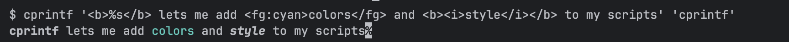

# bash-cprintf

Bash utilities for terminal colors and formatting:
- **cprintf** - Printf-like functionality with XML-style markup for colors and text effects
- **mdterm** - Markdown terminal renderer with syntax highlighting



## Features

### cprintf

- Printf-compatible formatting with color markup
- XML-style tags for colors and text effects
- Supports nested tags and inline modifiers
- 256-color and true color support
- Multiple color notation formats (decimal, hex, aliases)
- Reads from stdin or command line arguments
- Can be used as a library (sourced)

### mdterm

- Renders markdown with terminal colors
- Supports headings (H1-H4), emphasis, code, underline
- Fenced code blocks with syntax highlighting (via bat)
- Multiple input modes: arguments, stdin, files
- Configurable styling

## Installation

### Quick Install

```bash
curl -sSL https://tinyurl.com/mbzv9ex9 | sudo bash
```

This installs both `cprintf` and `mdterm` to `/usr/local/bin/`.

### Manual Install

```bash
wget https://github.com/antonjk/bash-cprintf/archive/refs/heads/main.zip
unzip main.zip
cd bash-cprintf-main
sudo make install
```

Installs:
- `/usr/local/bin/cprintf` - Main executable
- `/usr/local/bin/mdterm` - Markdown renderer
- `/usr/local/share/man/man1/cprintf.1` - Man page
- `/usr/local/share/man/man1/mdterm.1` - Man page

### From Source

```bash
git clone https://github.com/antonjk/bash-cprintf.git
cd bash-cprintf
chmod +x cprintf mdterm
```

## Usage

### cprintf

```bash
# Basic usage
./cprintf "<fg:red>Error:</fg> <b>%s</b>\n" "File not found"

# Pipe input
echo "<fg:blue>Hello World</fg>" | ./cprintf

# Nested tags
./cprintf "<fg:red><b>Bold Red</b></fg>\n"

# Use as library
source ./cprintf
cprintf "<fg:green>Success:</fg> %s\n" "Operation completed"

# Check color support
./cprintf --check-color-support

# View all supported tags
./cprintf --supported-tags

# Color code reference
./cprintf --color-codes
```

### mdterm

```bash
# Render markdown from arguments
./mdterm "# Title\nSome **bold** and *italic* text"

# Render from stdin
echo "# Hello World" | ./mdterm
cat README.md | ./mdterm

# Render from file(s)
./mdterm -f document.md
./mdterm -f file1.md file2.md file3.md

# Custom bat theme for code blocks
./mdterm --bat-args "--theme=Dracula --style=numbers" -f code.md
```

## cprintf Tags and Features

### Supported Tags

- `<fg:color></fg>` - Foreground color
- `<bg:color></bg>` - Background color
- `<b></b>` - Bold text
- `<i></i>` - Italic text
- `<u></u>` - Underlined text
- `<dim></dim>` - Dim text
- `<inv></inv>` - Inverted colors
- `<hidden></hidden>` - Hidden text
- `<strike></strike>` - Strikethrough text
- `<blink></blink>` - Blinking text

### Color Notation

**Decimal:**
- `0-7` - Standard colors
- `8-15` - High intensity colors
- `16-255` - 8-bit extended colors
- `256+` - 24-bit true colors

**Hex:**
- `#0-#7` - Standard colors
- `#8-#F` - High intensity colors
- `#00-#FF` - 8-bit extended colors
- `#RRGGBB` - 24-bit true colors

**Aliases:**
- Lowercase: `red`, `green`, `blue`, etc. (standard)
- Capitalized: `Red`, `Green`, `Blue`, etc. (high intensity)

### Color Modifiers

- `!` - Bold effect
- `*` - Italic effect
- `_` - Underline effect
- `=` - Strikethrough effect
- `~` - Invert effect
- `+` - High intensity
- `-` - Low intensity

Example: `<fg:red!*_>Bold italic underlined red</fg>`

## mdterm Markdown Support

### Supported Syntax

- `# Heading 1` - H1 style (cyan+)
- `## Heading 2` - H2 style (yellow+)
- `### Heading 3` - H3 style (magenta)
- `#### Heading 4` - H4 style (white+)
- `*italic*` - Italic text
- `**bold**` - Bold text
- `***bold italic***` - Bold + italic
- `` `code` `` - Inline code (green on black)
- `_underline_` - Underlined text
- ` ```lang ` - Fenced code blocks (syntax highlighted with bat)

### Style Combinations

Styles can be nested:
- `_*italic underline*_`
- `_**bold underline**_`

## Documentation

View man pages:
```bash
man cprintf
man mdterm
```

Online help:
```bash
cprintf --help
mdterm --help
```

## Build System

The project includes a build script for creating different cprintf variants:

```bash
# Build full version (default)
./scripts/build-cprintf full

# Build minimal core
./scripts/build-cprintf core

# Build library version
./scripts/build-cprintf lib

# Build all variants
./scripts/build-cprintf all

# Show help
./scripts/build-cprintf --help
```

## Contributing

See [CONTRIBUTING.md](CONTRIBUTING.md) for development guidelines.

## License

MIT License - see LICENSE file for details.
