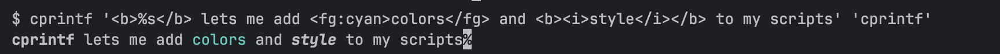

# bash-cprintf

**cprintf** — printf-like formatting with XML-style markup for terminal colors and
text effects. Nested tags, inline modifiers, 256-color and true color, multiple
notation formats (decimal, hex, aliases). Works as a command or as a sourced
library.



## Features

- Printf-compatible formatting with color markup
- XML-style tags for colors and text effects
- Nested tags and inline modifiers
- 256-color and true color support
- Decimal, hex, and alias color notations
- Reads from stdin or command-line arguments
- Usable as a library (sourced)

## Installation

### Homebrew (recommended)

```bash
brew install antonjk/tap/cprintf
```

### From source

```bash
git clone https://github.com/antonjk/bash-cprintf.git
cd bash-cprintf
make install            # builds dist/cprintf-full and installs it as `cprintf`
```

`make install` installs:
- `$(PREFIX)/bin/cprintf` — the command (defaults to `PREFIX=/usr/local`)
- `$(PREFIX)/share/man/man1/cprintf.1` — man page

## Usage

```bash
# Basic usage
cprintf "<fg:red>Error:</fg> <b>%s</b>\n" "File not found"

# Pipe input
echo "<fg:blue>Hello World</fg>" | cprintf

# Nested tags
cprintf "<fg:red><b>Bold Red</b></fg>\n"

# Use as a library
source "$(command -v cprintf)"
cprintf "<fg:green>Success:</fg> %s\n" "Operation completed"

# Check color support / references
cprintf --check-color-support
cprintf --supported-tags
cprintf --color-codes
```

## Tags and Features

### Supported Tags

- `<fg:color></fg>` - Foreground color
- `<bg:color></bg>` - Background color
- `<b></b>` - Bold text
- `<i></i>` - Italic text
- `<u></u>` - Underlined text
- `<dim></dim>` - Dim text
- `<inv></inv>` - Inverted colors
- `<hidden></hidden>` - Hidden text
- `<strike></strike>` - Strikethrough text
- `<blink></blink>` - Blinking text

### Color Notation

**Decimal:** `0-7` standard, `8-15` high intensity, `16-255` 8-bit, `256+` true color.

**Hex:** `#0-#7` standard, `#8-#F` high intensity, `#00-#FF` 8-bit, `#RRGGBB` true color.

**Aliases:** lowercase `red`/`green`/`blue`… (standard); capitalized `Red`/`Green`…
(high intensity).

### Color Modifiers

`!` bold, `*` italic, `_` underline, `=` strikethrough, `~` invert, `+` high
intensity, `-` low intensity. Combine them, e.g.
`<fg:red!*_>Bold italic underlined red</fg>`.

## Build System

```bash
./scripts/build-cprintf full     # all optional CLI modules (default) -> dist/cprintf-full
./scripts/build-cprintf lib      # core + color-support, for sourcing -> dist/cprintf-lib
./scripts/build-cprintf core     # minimal core                       -> dist/cprintf-core
./scripts/build-cprintf all      # all variants
./scripts/build-cprintf clean
```

## Examples

The [`examples/`](examples/) directory contains demos, including **mdterm**, a small
markdown terminal renderer built on cprintf (it uses the vendored `examples/imgcat`
for inline images). These are illustrations of cprintf in use, not part of the
installed tool.

## Documentation

```bash
man cprintf
cprintf --help
```

## Contributing

See [CONTRIBUTING.md](CONTRIBUTING.md).

## License

MIT License — see `LICENSE`.
